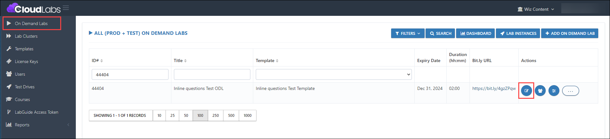
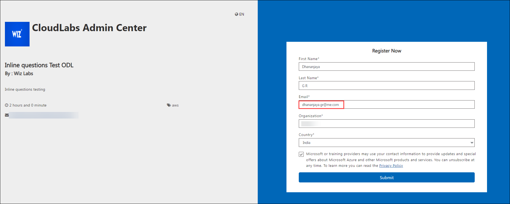

# Personal email consideration in tenant level

### Overview

Users can now register for the lab with the following domains: **me.com** and **icloud.com.**

### Prerequisites

- Before allowing personal email consideration in the ODL, ensure you have the following prerequisites:
  
  Admin access to [CloudLabs Admin Portal](https://admin.cloudlabs.ai/) (If access is unavailable, kindly reach out to your point of contact or [CloudLabs Support](https://docs.cloudlabs.ai/RequestSupport)).

### Allowing Personal email consideration

1. Log in to the CL portal and navigate to the required tenant (WIZ). On the left-hand side of the page, you will see the ODL section.

2. Navigate to the necessary ODL and select the **edit (1)** option.

   

3. Then navigate down and select the checkbox labeled **Allow personal email addresses.**

   

4. Click on the **Submit** button.

   

Testing scenario:

1. **Allow personal email addresses** enabled:

   

   

2. **Allow personal email addresses** disabled:
   
   
