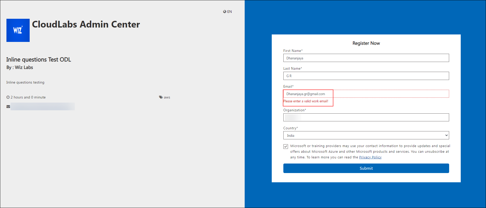

# Personal email consideration in tenant level

Users can now register with the following domains: **me.com** and **icloud.com.**

>**Note:** To allow personal email consideration, follow the steps below:

1. Navigate to the necessary tenant and select the **edit (1)** option.

   

2. Then navigate down and select the checkbox labeled **Allow personal email addresses.**

   

3. Click on the **Submit** button.

   

Testing scenario:

1. **Allow personal email addresses** enabled:

   

   

2. **Allow personal email addresses** disabled:
   
   
